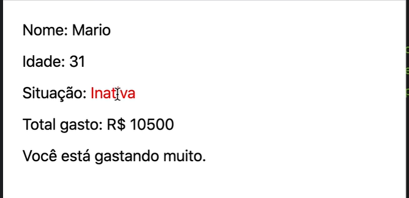
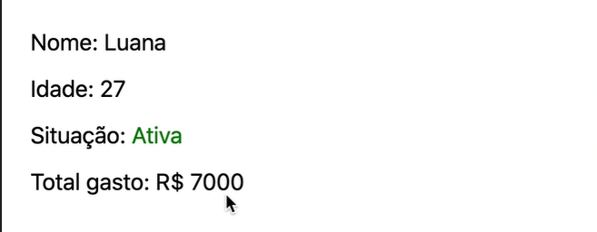
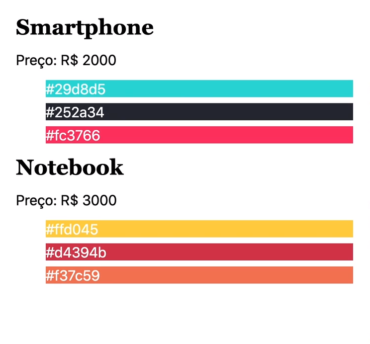

[](https://classroom.github.com/a/EmdFXqfL)
# Exercicios de JSX 


- Crie uma aplicação react utilizando o vite e o template react-js
- Para cada exercicio deverá ser criado um componente na pasta src/components
- Cada componente deverá ser importado no arquivo App.js
- Cada componente deverá ser renderizado no arquivo App.js

## Exercicio 1

- Crie um componente chamado `exercicio1`
- O componente deverá renderizar um elemento `h1` com o texto `Exercicio 1`
- O componente deverá renderizar um elemento `p` com o texto `Este é o exercicio 1`
- Crie uma constante chamada `nome` com o valor `React`
- O componente deverá renderizar um elemento `p` com o texto `Olá, meu nome é React`
- Utilize o operador ternário para renderizar o elemento `p` com o texto `Olá, meu nome é React` apenas se a constante `nome` for igual a `React`

# Exercicio 2

- Crie um componente chamado `exercicio2`
- O componente deverá renderizar um elemento `h1` com o texto `Exercicio 2`
- Aplique um estilo ao elemento `h1` para que o texto seja vermelho e o tamanho da fonte seja 20px utilizando a propriedade `style`

# Exercicio 3
 - Crie um componente Header com o logo , menus de navegação e um botão de login
 - Utilize o arquivo de css externo para estilizar o header


# Exercicio 4
 - Mostre os dados conforme apresntado na imagem 
 - utilize a propriedade style para estilizar o componente
 - Se a situação estiver ativa o texto deve ser verde
 - Se a situação estiver inativa o texto deve ser vermelho
 -  Se o gasto for maior que 10000 mostre uma mensagem de alerta

Teste o componente com os seguintes dados:
```js
const luana = {
  cliente: 'Luana',
  idade: 27,
  compras: [
    { nome: 'Notebook', preco: 'R$ 2500' },
    { nome: 'Geladeira', preco: 'R$ 3000' },
    { nome: 'Smartphone', preco: 'R$ 1500' },
  ],
  ativa: true,
};

const mario = {
  cliente: 'Mario',
  idade: 31,
  compras: [
    { nome: 'Notebook', preco: 'R$ 2500' },
    { nome: 'Geladeira', preco: 'R$ 3000' },
    { nome: 'Smartphone', preco: 'R$ 1500' },
    { nome: 'Guitarra', preco: 'R$ 3500' },
  ],
  ativa: false,
};
```
Obs: O componente deve ser reutilizavel para outros clientes
Utilize o map e reduce para calcular o total de gastos do cliente

Imagem de exemplo:




# Exercicio 5 

- Organize os produtos como mostrado no vídeo
- Mostre apenas produtos que forem mais caros que R$ 1500

```jsx 	
const produtos = [
  {
    id: 1,
    nome: 'Smartphone',
    preco: 'R$ 2000',
    cores: ['#29d8d5', '#252a34', '#fc3766'],
  },
  {
    id: 2,
    nome: 'Notebook',
    preco: 'R$ 3000',
    cores: ['#ffd045', '#d4394b', '#f37c59'],
  },
  {
    id: 3,
    nome: 'Tablet',
    preco: 'R$ 1500',
    cores: ['#365069', '#47c1c8', '#f95786'],
  },
];

```

Imagem de exemplo:


obs: Para estilzar  as cores utilize o arry de cores que contem em cada produto